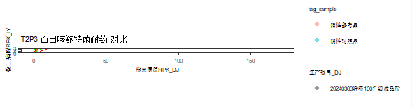

---
editor_options:
  markdown:
    wrap: 72
---

# **QC_check_report质量控制**

基于Demo-win8 上传至git上，便于版本管理:

# main

## **20240501修订**：

```         
1：添加了质检软件说明文档-V2
2：优化耐药中空数据的对比情况。compare pdf中耐药比对的顺序。
3：优化污染检测表格中 病原为空的 情况。
4：优化了汇总表格中，“其它病原”为 NA/NA/NA 的情况。
5：优化了汇总表格中，空病原 QC结果为空 的情况。
6：历史回顾性文件中：a）:本轮次未做的企参样本，不出现在history pdf中;b）：
  统计60个时间点的x轴坐标。
7：解决error.log和succeed.log输出问题，succeed.log修改为pre-succeed.log
```

## **20240502修订**：

-   **A：compare pdf作图顺序：**

```         
1：内参合计对比
2：人内参对比
3：外源内参对比
4：所有病原对比
5：每个病原对比（按字母顺序）
6：耐药对比（按字母顺序）：
（肺支耐药和百日咳耐药放在各病原对比的后面，外源内参、所有病原对比需放在PDF图文件的第一页，需优化一下PDF图顺序;
```

-   **B：修改最终的输出结果，最终顺序由尔康调整**
-   **C：产品检完整性检查；**
-   **D：各文库合格标准评估；（从汇总表中截取；修改表头）**
-   **E：各病原污染情况评估；（修改表头）**
-   **F：待检试剂 vs留样试剂病原效率评估；（各病原污染情况评估）**
-   **G：最终合格情况**

## **20240507修订**：

1.  compare pdf
    第一页的作图顺序：原始数据量、Q30、总内参、总人内参、外源内参、所有病原RPK、目标病原RPK
2.  2.2
    各文库合格标准评估中添加一列"不合格原因"，包括：原始数据不合格，Q30不合格，外源内参不合格，内参不合格，病原污染，耐药污染，目标病原漏检或偏低等
3.  质检系统说明文档修订： 汇总表、目标病原比对表等的说明放在3
    附录：其它结果文件说明
4.  patho_namezn 为甲型流感病毒2009，型别为甲型流感病毒，这种情况的判别
5.  修订了config.xlsx 将甲型流感替换为甲型流感病毒的index删掉了.

## **20240509修订**：

**1：企参对比表修改为QC对比；并按要求修改和增添表头：**

```         
run 体系  tag tag_sample  目标病原    DJ_sample   LY_sample   DJ_原始数据 LY_原始数据 DJ_Q30  LY_Q30  DJ_目标病原RPK  LY_目标病原RPK  DJ_外源内参 LY_外源内参 DJ_总人内参 LY_总人内参 DJ_resis_info   LY_resis_info   DJ_质控评价 LY_质控评价 DJ_生产批号 LY_生产批号 DJ_文库浓度 LY_文库浓度 DJ_最终评价 LY_最终评价 DJ_不合格原因    LY_不合格原因
```

**2：质检结果的 2.3 各病原污染情况评估 表格，按照要求修改表头**

**3：最终评价模块的修改，重新调整了 最终评价和不合格原因 的标准：**

-   "临床样本"出现 "不合格" 最终评价写不合格，
    不合格原因再写原始数据不合格/或内参不合格等
-   最终评价和不合格原因评判标准为：

**4：解决同一个样本中出现 甲型流感病毒 和
甲型流感病毒(2009H1N1)的情况：**

-   在"待检-留样对比"中，两条terms都保留，
-   以甲型流感病毒(2009H1N1)对应的"最终评价"作为该样本的"最终评价"

**5：QC_compare图的修改：**

-   将出现的"三叶草根瘤菌(NA)" 重新改名为 ： 外源内参
-   作图顺序调整为：原始数据量、Q30、总内参、总人内参、外源内参、所有病原RPK、目标病原RPK、每个病原对比、耐药对比；
-   每个病原对比图
    中按照字母顺序排序（但是是按中文后英文字母的方式进行排序，目前没有时间去解决这个问题）
-   每个病原对比图 中的待检留样比率散点图，只保留：y=0.7
    y=0.5的虚线，其他黑色虚线都去掉

**6：说明文档的修改：**

-   表格截图换成表格
-   说明文档中的表格按照最新的质检结果表来修订
-   保留：汇总表、QC对比表、待检-留样对比等sheet，放在第三部分：3附录：其它结果文件说明
-   文档的第二部分：2 质检系统输出图表结果说明 ==\> 需要将
    ：QC_compare.run_ID.pdf的说明纳入到"2.4
    待检试剂vs留样试剂病原效率评估"小结中。

## **20240510修订：**

1.  关于污染检测表（df5_cc_other_patho_final）中的百日咳耐药不合格判定调整为：PRK
    median \> 500

2.  污染检测表中，样本数量的bug修复

3.  最终评价为不合格的原因添加一条：原始数据不合格，现行标准为：

    

4.  编写说明文档：包括一些常见的错误事项

## **20240511修订：**

1.  软件添加一个核对功能，目的是对：Samplesheet 和 质检表
    中样本信息的核对

    质检表中输出一个其余信息：用以输出这部分信息

2.  散点图的参考线的修订：slope调整为4，2，1，0.5，0.25

## **20240512修订：**

1.  修订软件中回顾信息仅能纳入本轮"原始数据"的Bug

2.  修订current_history_results.lastime.xlsx，并替换至系统上，原相关文件位于：

    `/home/luxingbang/01_work/04_retro/02_new_retro_file_20240512_replace`

3.  核对和修改说明文档

## 20240521修订：

-   对比图中，还需要区分待检批次

## 20240529修订：

-   针对NTC耐药大于500的情况，不会给出不合格原因

-   针对待检-留样对比 Sheet 的
    "三叶草"以及"枯草芽孢"名称的修改，修改为：外源内参；阳性对照品

## 20240530修订：

-   对比图中，区分待检批次：以DJ的生产批次为准

-   历史回顾性图中，区分历史的待检和留样

-   回顾性图中，横坐标字体调整，调整大一些；横坐标调整至20个时间点

## 20240627修订：

-   简化添加最终评价的部分代码；修改目标病原是百日咳可能会给出最终评价为不合格的bug
    ，原因是：resis_info会出现为空的情况（检测线参考品、重复性参考品、阳性参考品的样本）

-   修改质检模板表中企参编号为空的情况，避免由于模板表填写不规范而导致NTC和临床样本能够匹配到目标病原的bug

## 20240702修订：

-   对于未检出目标病原的情况，不合格原因修改为：目标病原漏检

## 20240705修订：

-   使用stop 终止 目标病原为空的情况，并抛出错误

-   阴性对照品加的是外源内参，没有加人内参。

-   阴性参考品就是专门用来检测人内参的，人内参不合格的标准是：人内参 ≤
    200

-   所有样本类型的原始数据不合格的标准："原始数据量为空" ===\>
    "原始数据量 ≤ 50000

-   附最新的最终判断及不合格原因：

    

## 20240708修订：

-   修复耐药drug信息中，resis_rpk，resis_RawDep中为"-"的情况，造成class不一致无法合并的bug

## 20240711修订：

-   添加有效数据比例（valid_reads_ratio）到QC对比表中；多处添加修改

## 20240716修订：

-   针对0702的进一步修订。单次质检可能不会出现企参样本，不会有目标病原，将之前的stop修改为warn。

## 20240722修订：

-   QC对比表和"留样-待检对比"表中，耐药情况 添加到 检出病原 中

## 20240910修订：V1.3版本

**添加T2P3体系，需要作如下修改：**

1.  增添T2P3的企参到企参组成中，同时要按照体系去匹配企参对应的病原

2.  T2P3的质控合格规则需要单独判别：

3.  汇总表修改===\>针对T2P3体系修改：

    1.  如待检试剂未检出非目标病原体（或预判结果为"滤"），且未检出目标病原体关联的病原耐药（或病原耐药RPK不大于300），待检试剂出现以下内容中的任意一条，则认为污染不可接受，需排查后重新复测：

        -   NEG、POS重复3个样本，如检出非目标病原2个弱阳或1个阳性，或检出病原耐药RPK\>300大于1个样本，或检出人内参RPK\>50大于1个样本，认为不合格，建议复测该样本；===\>
            ：针对T2P3 体系的 NEG（阴性对照）和 POS 进行修改

        -   对于企业参考品，检出阳性或弱阳非目标病原，或检出非目标病原关联耐药RPK\>300，认为污染，建议复测该样本；

    2.  2.2个文库合格标准评估：添加体系和生成批号

    3.  各病原污染统计，针对T2P3要考虑常见背景微生物；表格添加体系

    4.  T2P3体系的耐药关系多，需要新读入一个耐药和病原的对应关系；都是肺炎克雷伯菌的耐药基因；即新增一列，耐药/毒力，用于记录那些
        病原关联的 耐药/毒力
        信息，由于是关联的，所以，这里就不需要对它作耐药判断了。

4.  部分病原的名称转换需要调整（需要和系统上的病原名一致）：

    1.  人腺病毒4型 ： 腺病毒4型

    2.  白念珠菌（patho_name_fix：Original_name） ：向上归为
        念珠菌属（patho_name_fix：replacement）

    3.  人副流感病毒（patho_name_fix：Original_name）：向下归为
        人腮腺炎病毒2型（人副流感病毒2型）（patho_name_fix：replacement）

## 20240911修订：

1.  目标病原全部修改为系统现用名：修改文件：

    1.  config.xlxs：patho_name_fix，修订范围，删除以下：

        |                     |                                     |
        |---------------------|-------------------------------------|
        | **Original_name**   | replacement                         |
        | 肠道病毒A71型       | 肠道病毒71型                        |
        | 呼吸道合胞病毒A型   | 呼吸道合胞病毒A型                   |
        | 腺病毒4型           | 腺病毒4型（\*注意，还能正常检出？） |
        | 人呼吸道合胞病毒A型 | 呼吸道合胞病毒A型                   |

    2.  config.xlsx：patho_class，修订范围：

        | condition-原名称  | condition-修订后名称               |
        |-------------------|------------------------------------|
        | 肠道病毒71型      | 肠道病毒A71型                      |
        | 呼吸道合胞病毒A型 | 人呼吸道合胞病毒A型                |
        | 腺病毒4型         | 人腺病毒4型                        |
        | 人副流感病毒2型   | 人腮腺炎病毒2型（人副流感病毒2型） |

    3.  质检模板表：企参列表的型别修订，修改范围：

        | 型别-原名称       | 型别-修订后名称                    |
        |-------------------|------------------------------------|
        | 肠道病毒71型      | 肠道病毒A71型                      |
        | 呼吸道合胞病毒A型 | 人呼吸道合胞病毒A型                |
        | 腺病毒4型         | 人腺病毒4型                        |
        | 人副流感2型       | 人腮腺炎病毒2型（人副流感病毒2型） |

2.  给出不合格原因：层级：原始数据不合格；Q30不合格；人内参不合格；目标病原漏检；病原污染；耐药污染

3.  本轮版本更新：同步更新替换的文件，质检模板表、config.xlsx、脚本文件

## 20240912修订：

1.  对于T2P3体系的POS（阳性对照品）和NEG（阴性对照品），如果同时出现多个不合格原因，在不合格原因这列需要全部列上，以"；"分隔。
2.  T2P3体系的NEG没有目标病原漏检，同步修改不合格原因

## 20240914修订：

-   T2P3新增背景微生物，嗜麦芽窄食单胞菌，洋葱伯克霍尔德菌复合群，阴沟肠杆菌复合群，大肠埃希菌，镰刀菌属，铜绿假单胞菌（新增）
-   修复bug：修复当df5_cc_stat不存在"外源病原"和 \`耐药/毒力基因\`
    列时的报错，不存在就添加这两列
-   修复bug：

## 20240929修订：

-   针对目标病原是百日咳，但resis_info是空时，最终评价误判该样本为不合格的情况：实际上目标病原是百日咳，耐药不一定要检出百日咳耐药。使用
    `str_detect(resis_info, "百日咳|^$")` 判断

-   针对不合格原因修订：针对目标病原是百日咳，但resis_info是其余耐药（肺支，脓肿，结核等），而不给出不合格原因的情况

-   针对T2P3的耐药，需要去Patho_report_final_format.trim.rptname.ntinfo.addsemi.zip文件去单独拿结核耐药和脓肿耐药的结果，判断是否耐药污染。大版本更新

-   后续对于耐药的判断，需要区分体系，耐药结果都从\*\*.addsemi文件中拿数据。目前百日咳、肺支是在T2P3,，T2P2，T3P3的体系下。结核耐药、肺支耐药是在T2P3的体系下。

    -   脓肿分枝杆菌耐药

    -   耐药结核

-   ~~质检说明文档需要更新~~

-   质检模板表需要讨论后更新

-   其余说明

`修订最终评价的判断：针对同一企参，在case_when中执行2部判断，可能会出现第2步判断条件无法识别，但目前这种情况只会出现在第一个条件满足的情况下。如果第一个条件不满足，则第二个条件就会去识别，直到找到第一个满足的条件为止。所以目前这个逻辑是正确的，不需要修改`

## 20241009修订：V1.5

-   新增并优化感染1000的体系的质控标准

-   感染1000，前期命名规范不标准，需要按照【体系编号】-【样本编号】-【实验条件】的标准填写

-   感染1000的最终判断的标准：

    -   NEG、POS重复3个样本，如检出非目标病原2个弱阳或1个阳性，或检出病原耐药RPK\>300大于1个样本，或检出人内参RPK\>50大于1个样本，认为不合格，建议复测该样本；===\>
        ：针对感染1000体系的 NEG（阴性对照）和 POS 进行修改。

    -   对于企业参考品，检出非目标病原且非常见背景微生物，且预判结果不为"滤"，认为污染。

    -   对于企业参考品，检出非目标病原且非常见背景微生物，在本批次样本（指本批次指待检批次的POS、NEG和所有企业参考品，下同）中，样本发生率≥50%，且阳性或弱阳的样本数≥2，认为不合格。结论附在**"2.3各病原污染情况评估"**

    -   对于企业参考品，检出常见背景微生物，在本批次样本中，样本发生率≥50%，且病原RPK平均值＞50，认为不合格；结论附在**"2.3各病原污染情况评估"**

    -   感染1000参见的背景微生物：

        -   嗜麦芽窄食单胞菌

        -   洋葱伯克霍尔德菌复合群

        -   人葡萄球菌

        -   表皮葡萄球菌

        -   季也蒙毕赤酵母

        -   嗜水气单胞菌

        -   耳念珠菌

        -   黏质沙雷菌

        -   咽峡炎链球菌

其余：感染1000没加外源内参，人内参


(注：感染1000之前还没有考虑到耐药污染；现先按照T2P3耐药的程序写)

## 20241023修订：

-   对
    \"表2-对比信息表\"中的样本名填写不规范，添加矫正功能，剔除那些没有进行对比而留空的行

    -   Debug：对\"表2-对比信息表\"中，剔除不成对的样本行

-   更新：config.xlsx表格的\"patho_class\"
    Sheet中添加T2P3的POS，核对有无其余遗漏。同时更新上机信息表中的\"企参列表\"，其中T2P3-POS和T2P3-NEG
    的体系书写有误，已修订，在下一版本（V1.4）的上机信息表同步发布。

-   修复Bug：解决 print(multi_page_plots) 出现的Error in
    grid.Call.graphics(C_setviewport, vp, TRUE)

-   修复Bug：绘制各个病原图的时候出现由于NA值而导致Removed 3 rows
    containing missing，而出现

    

    -   Debug：将df5_all_compare中的空的病原RPK替换为0
