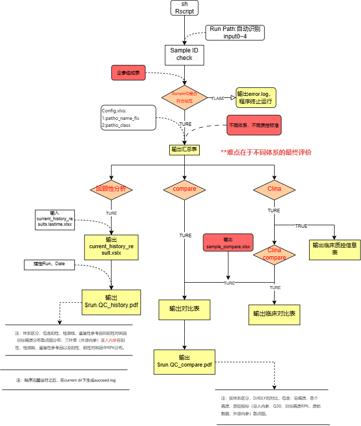

# **QC_check_report**

tNGS 体外诊断试剂质量控制检测程序

## Rscript Pipline：

注：

-   本脚本经过多轮迭代，历史迭代版本信息见01_other_info/Pre_README.md

-   本脚本适用于部分体系，不同体系的最终评价标准有差异，具体见01_other_info/最终判断逻辑.svg

-   输出的最终示例结果见：Test_QC_compare.pdf、Test_QC_result.xlsx、Test_QC_retro.pdf
