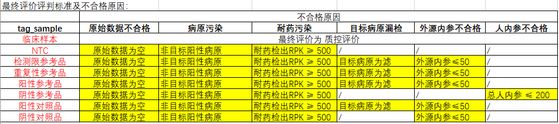

# **QC_check_report质量控制**

基于Demo-win8 上传至git上，便于版本管理:

# main

## **20240501修订**：

```         
1：添加了质检软件说明文档-V2
2：优化耐药中空数据的对比情况。compare pdf中耐药比对的顺序。
3：优化污染检测表格中 病原为空的 情况。
4：优化了汇总表格中，“其它病原”为 NA/NA/NA 的情况。
5：优化了汇总表格中，空病原 QC结果为空 的情况。
6：历史回顾性文件中：a）:本轮次未做的企参样本，不出现在history pdf中;b）：
  统计60个时间点的x轴坐标。
7：解决error.log和succeed.log输出问题，succeed.log修改为pre-succeed.log
```

## **20240502修订**：

-   **A：compare pdf作图顺序：**

```         
1：内参合计对比
2：人内参对比
3：外源内参对比
4：所有病原对比
5：每个病原对比（按字母顺序）
6：耐药对比（按字母顺序）：
（肺支耐药和百日咳耐药放在各病原对比的后面，外源内参、所有病原对比需放在PDF图文件的第一页，需优化一下PDF图顺序;
```

-   **B：修改最终的输出结果，最终顺序由尔康调整**
-   **C：产品检完整性检查；**
-   **D：各文库合格标准评估；（从汇总表中截取；修改表头）**
-   **E：各病原污染情况评估；（修改表头）**
-   **F：待检试剂 vs留样试剂病原效率评估；（各病原污染情况评估）**
-   **G：最终合格情况**

## **20240507修订**：

1.  compare pdf
    第一页的作图顺序：原始数据量、Q30、总内参、总人内参、外源内参、所有病原RPK、目标病原RPK
2.  2.2
    各文库合格标准评估中添加一列"不合格原因"，包括：原始数据不合格，Q30不合格，外源内参不合格，内参不合格，病原污染，耐药污染，目标病原漏检或偏低等
3.  质检系统说明文档修订： 汇总表、目标病原比对表等的说明放在3
    附录：其它结果文件说明
4.  patho_namezn 为甲型流感病毒2009，型别为甲型流感病毒，这种情况的判别
5.  修订了config.xlsx 将甲型流感替换为甲型流感病毒的index删掉了.

## **20240509修订**：

**1：企参对比表修改为QC对比；并按要求修改和增添表头：**

```         
run 体系  tag tag_sample  目标病原    DJ_sample   LY_sample   DJ_原始数据 LY_原始数据 DJ_Q30  LY_Q30  DJ_目标病原RPK  LY_目标病原RPK  DJ_外源内参 LY_外源内参 DJ_总人内参 LY_总人内参 DJ_resis_info   LY_resis_info   DJ_质控评价 LY_质控评价 DJ_生产批号 LY_生产批号 DJ_文库浓度 LY_文库浓度 DJ_最终评价 LY_最终评价 DJ_不合格原因    LY_不合格原因
```

**2：质检结果的 2.3 各病原污染情况评估 表格，按照要求修改表头**

**3：最终评价模块的修改，重新调整了 最终评价和不合格原因 的标准：**

-   "临床样本"出现 "不合格" 最终评价写不合格，
    不合格原因再写原始数据不合格/或内参不合格等
-   最终评价和不合格原因评判标准为：

**4：解决同一个样本中出现 甲型流感病毒 和
甲型流感病毒(2009H1N1)的情况：**

-   在"待检-留样对比"中，两条terms都保留，
-   以甲型流感病毒(2009H1N1)对应的"最终评价"作为该样本的"最终评价"

**5：QC_compare图的修改：**

-   将出现的"三叶草根瘤菌(NA)" 重新改名为 ： 外源内参
-   作图顺序调整为：原始数据量、Q30、总内参、总人内参、外源内参、所有病原RPK、目标病原RPK、每个病原对比、耐药对比；
-   每个病原对比图
    中按照字母顺序排序（但是是按中文后英文字母的方式进行排序，目前没有时间去解决这个问题）
-   每个病原对比图 中的待检留样比率散点图，只保留：y=0.7
    y=0.5的虚线，其他黑色虚线都去掉

**6：说明文档的修改：**

-   表格截图换成表格
-   说明文档中的表格按照最新的质检结果表来修订
-   保留：汇总表、QC对比表、待检-留样对比等sheet，放在第三部分：3附录：其它结果文件说明
-   文档的第二部分：2 质检系统输出图表结果说明 ==\> 需要将
    ：QC_compare.run_ID.pdf的说明纳入到"2.4
    待检试剂vs留样试剂病原效率评估"小结中。

## **20240510修订：**

1.  关于污染检测表（df5_cc_other_patho_final）中的百日咳耐药不合格判定调整为：PRK
    median \> 500

2.  污染检测表中，样本数量的bug修复

3.  最终评价为不合格的原因添加一条：原始数据不合格，现行标准为：

    

4.  编写说明文档：包括一些常见的错误事项

## **20240511修订：**

1.  软件添加一个核对功能，目的是对：Samplesheet 和 质检表
    中样本信息的核对

    质检表中输出一个其余信息：用以输出这部分信息

2.  散点图的参考线的修订：slope调整为4，2，1，0.5，0.25

## **20240512修订：**

1.  修订软件中回顾信息仅能纳入本轮"原始数据"的Bug

2.  修订current_history_results.lastime.xlsx，并替换至系统上，原相关文件位于：

    `/home/luxingbang/01_work/04_retro/02_new_retro_file_20240512_replace`

3.  核对和修改说明文档

## 20240521修订：暂未修改

-   对比图中，还需要区分待检批次

## 20240529修订：

-   针对NTC耐药大于500的情况，不会给出不合格原因

-   针对待检-留样对比 Sheet 的
    "三叶草"以及"枯草芽孢"名称的修改，修改为：外源内参；阳性对照品

## 20240530修订：

-   对比图中，区分待检批次：以DJ的生产批次为准

-   历史回顾性图中，区分历史的待检和留样

-   回顾性图中，横坐标字体调整，调整大一些；横坐标调整至20个时间点
